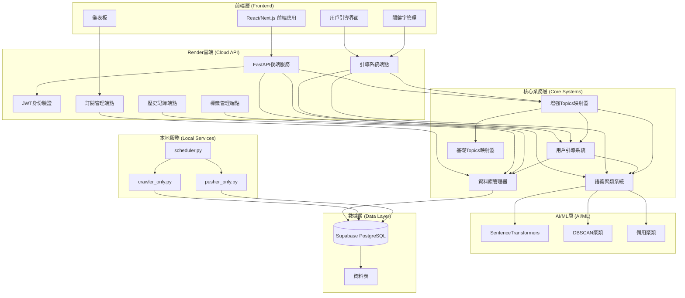
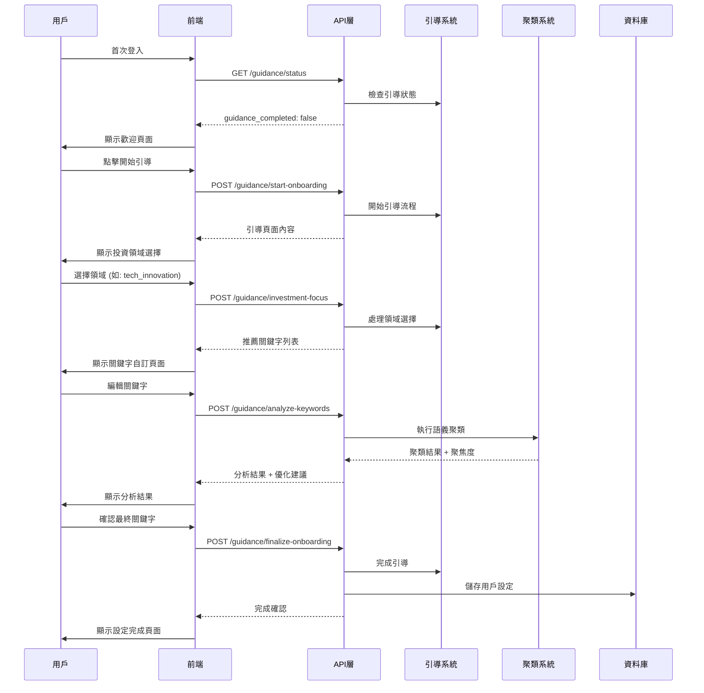
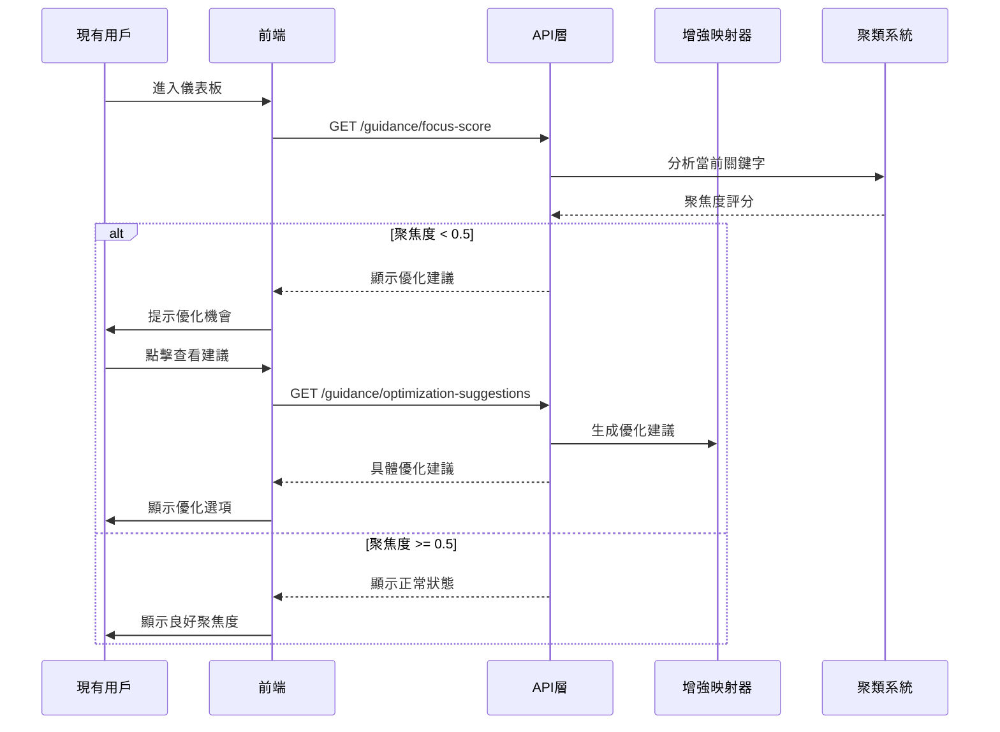

# FinNews-Bot 系統完整說明書 v2.1

## 📋 文件概覽

**文件版本**: v2.1  
**更新日期**: 2024-08-02  
**系統狀態**: 🟢 已完成開發，準備部署  
**架構類型**: Render雲端 + 本地爬蟲 + 用戶教育引導 + OpenAI智能語義聚類

---

## 🏗️ 系統架構概覽



### 🏠 **實際部署架構說明**

您的系統採用**混合部署模式**，結合雲端和本地的優勢：

- **🌐 Render雲端**: 託管 FastAPI 後端服務（包含新的引導端點）
- **💻 本地服務**: 爬蟲、推送器、排程器在您本地運行
- **📄 Supabase**: 雲端 PostgreSQL 資料庫（包含新的引導相關資料表）
- **🌐 前端**: 將來部署到 Vercel/Netlify，呼叫 Render API

**優勢**：
- ✅ **成本效益**: Render免費層 + 本地爬蟲
- ✅ **靈活性**: 本地爬蟲可以隨時調整頻率
- ✅ **穩定性**: 核心API在雲端，爬蟲在本地
- ✅ **擴展性**: 未來可以輕易遷移到全雲端

---

## 📁 項目結構

```
finnews-bot/
├── 📂 api/                           # FastAPI 應用層
│   ├── __init__.py
│   ├── auth.py                       # JWT 身份驗證
│   ├── main.py                       # 主API應用
│   └── 📂 endpoints/                 # API端點模組
│       ├── __init__.py
│       ├── guidance.py               # 🆕 用戶引導API (15個端點)
│       ├── history.py                # 推送歷史API
│       ├── subscriptions.py          # 訂閱管理API
│       └── tags.py                   # 標籤管理API
│
├── 📂 core/                          # 核心業務邏輯層
│   ├── __init__.py
│   ├── config.py                     # 系統配置
│   ├── database.py                   # 🔄 資料庫管理 (新增11個方法)
│   ├── enhanced_topics_mapper.py     # 🆕 增強版Topics映射器
│   ├── enhanced_utils.py             # 增強工具函數
│   ├── semantic_clustering.py        # 🆕 語義聚類系統
│   ├── tag_manager.py                # 標籤管理系統
│   ├── topics_mapper.py              # 基礎Topics映射器
│   ├── user_guidance.py              # 🆕 用戶引導系統
│   └── utils.py                      # 基礎工具函數
│
├── crawler_only.py                   # 本地新聞爬蟲腳本
├── pusher_only.py                    # 本地推送腳本
├── scheduler.py                      # 本地排程器
├── render.yaml                       # Render部署配置
│
├── 📂 migration_scripts/             # 資料庫遷移
│   ├── add_user_guidance_tables.sql  # 🆕 引導系統資料表
│   └── run_guidance_migration.py     # 🆕 遷移執行腳本
│
├── 📂 tests/                         # 測試系統
│   ├── test_api_endpoints.py         # 🆕 API端點測試
│   ├── test_guidance_system.py       # 🆕 引導系統測試
│   └── test_integration.py           # 🆕 整合測試
│
├── 📂 docs/                          # 文檔
│   ├── FRONTEND_INTEGRATION_GUIDE.md # 🆕 前端整合指南
│   ├── SYSTEM_MANUAL_v2.1.md        # 🆕 本系統說明書
│   └── TAG_SYSTEM_WORKFLOW.md       # 標籤系統工作流程
│
├── requirements.txt                   # 🔄 Python依賴 (新增ML庫)
├── database_simplified_schema.sql    # 簡化資料庫架構
├── ai_tag_integration.py             # AI標籤整合
└── README.md                         # 項目說明
```

---

## 🎯 核心系統詳解

### 1. 用戶引導系統 (User Guidance System)

**位置**: `core/user_guidance.py`  
**目的**: 協助新用戶快速設定個人化投資關注領域

#### 主要功能
- **歡迎引導**: 引導新用戶了解系統功能
- **投資領域選擇**: 6個預定義投資領域選項
- **關鍵字推薦**: 基於選擇的領域自動推薦相關關鍵字
- **即時分析**: 實時分析用戶輸入的關鍵字聚焦度
- **優化建議**: 提供個人化的關鍵字優化建議

#### 投資領域選項
1. **科技與創新** (`tech_innovation`): AI、電動車、半導體等
2. **加密貨幣與數位資產** (`crypto_digital`): 比特幣、以太幣、區塊鏈
3. **傳統市場投資** (`traditional_markets`): 股市、房地產、債券
4. **總體經濟分析** (`macro_economics`): 通膨、利率、經濟政策
5. **企業事件追蹤** (`corporate_events`): 財報、併購、IPO
6. **多元化投資組合** (`mixed_portfolio`): 綜合投資資訊

#### 核心方法
```python
start_user_onboarding()              # 開始引導流程
process_investment_focus_selection() # 處理投資領域選擇
analyze_user_keywords()              # 分析用戶關鍵字
finalize_onboarding()               # 完成引導流程
optimize_existing_user()            # 為現有用戶提供優化
```

### 2. 語義聚類系統 (Semantic Clustering System)

**位置**: `core/semantic_clustering.py`  
**目的**: 分析關鍵字之間的語義相關性，計算聚焦度評分

#### 技術架構
- **主要引擎**: OpenAI Embeddings API (`text-embedding-ada-002`)
- **聚類算法**: DBSCAN (密度聚類)
- **備用機制**: 基於關鍵字匹配的規則聚類
- **相似度計算**: Cosine Similarity
- **成本**: 每次分析約 $0.0000015 USD，月成本預估 $1-5

#### 聚焦度評分算法
```python
def _calculate_focus_score(similarity_matrix, clusters):
    """
    聚焦度評分 (0-1 分數):
    - 1.0: 所有關鍵字高度相關
    - 0.8+: 優秀聚焦度
    - 0.5-0.8: 中等聚焦度，可優化
    - <0.5: 分散，需要重新聚焦
    """
```

#### 預計算主題向量
系統使用 OpenAI API 預先計算12個財經主題的語義向量：
- `crypto`, `tech`, `electric-vehicles`, `stock-market`
- `earnings`, `housing`, `inflation`, `economies`
- `mergers-ipos`, `tariff-updates`, `originals`, `latest`

**優勢**: 向量品質優秀 (1536維度)，部署包大小減少90%

### 3. 增強版Topics映射器 (Enhanced Topics Mapper)

**位置**: `core/enhanced_topics_mapper.py`  
**目的**: 整合聚類分析與用戶引導，提供智能化的Topics映射

#### 增強功能
- **聚類整合**: 結合語義聚類結果優化映射
- **自動優化**: 基於聚焦度自動調整關鍵字
- **Topics限制**: 每用戶最多3個Topics，避免推送分散
- **信心度調整**: 基於聚焦度調整Topics信心分數

#### 優化策略
```python
def _optimize_keywords_with_clustering():
    """
    關鍵字優化策略:
    1. 保留最大的關鍵字群組
    2. 合併小群組中的相關關鍵字
    3. 移除與主群組無關的單一關鍵字
    4. 限制總關鍵字數量 (最多5個)
    """
```

### 4. 資料庫管理擴展 (Database Management Extension)

**位置**: `core/database.py`  
**新增**: 11個引導與聚類相關方法

#### 最小侵入式資料庫設計
1. **現有 subscriptions 表**: 新增4個引導相關欄位（不影響現有功能）
2. **user_guidance_history**: 新增引導歷史記錄表

#### 擴展的訂閱表欄位
```sql
-- subscriptions 表新增欄位
guidance_completed BOOLEAN DEFAULT FALSE,
focus_score FLOAT DEFAULT 0.0,
last_guidance_at TIMESTAMP,
clustering_enabled BOOLEAN DEFAULT TRUE
```

#### 新增核心方法
```python
save_user_guidance_history()        # 儲存引導歷史
save_keyword_clustering_result()    # 儲存聚類結果
get_user_preferences()              # 獲取用戶偏好
update_user_preferences()           # 更新用戶偏好
update_user_guidance_status()       # 更新引導狀態
get_users_needing_guidance()        # 獲取需要引導的用戶
get_users_with_low_focus_score()    # 獲取低聚焦度用戶
```

---

## 🚀 API端點系統

### 引導系統API (`/api/v1/guidance/*`)

#### 核心引導端點
```http
GET  /api/v1/guidance/status                    # 檢查用戶引導狀態
POST /api/v1/guidance/start-onboarding          # 開始用戶引導
POST /api/v1/guidance/investment-focus          # 處理投資領域選擇
POST /api/v1/guidance/analyze-keywords          # 分析關鍵字
POST /api/v1/guidance/finalize-onboarding       # 完成引導流程
```

#### 優化與分析端點
```http
GET  /api/v1/guidance/optimization-suggestions  # 獲取優化建議
GET  /api/v1/guidance/focus-score               # 獲取聚焦度評分
GET  /api/v1/guidance/enhanced-topics           # 獲取增強Topics
POST /api/v1/guidance/clustering-analysis       # 執行聚類分析
POST /api/v1/guidance/update-keywords           # 更新關鍵字
```

#### 歷史與管理端點
```http
GET  /api/v1/guidance/history                   # 獲取引導歷史
GET  /api/v1/guidance/admin/users-needing-guidance    # 管理員: 需要引導的用戶
GET  /api/v1/guidance/admin/users-low-focus           # 管理員: 低聚焦度用戶
```

### 現有API端點
```http
# 訂閱管理
GET/POST/PUT/DELETE /api/v1/subscriptions/*

# 推送歷史
GET /api/v1/history/*

# 標籤管理  
GET /api/v1/tags/*

# 系統狀態
GET /api/v1/health
GET /api/v1/config
```

---

## 🗄️ 資料庫架構

### 核心資料表

#### 1. subscriptions (訂閱表) - 已擴展
```sql
CREATE TABLE subscriptions (
    user_id UUID PRIMARY KEY,
    keywords TEXT[],
    is_active BOOLEAN DEFAULT TRUE,
    push_frequency_type VARCHAR(20) DEFAULT 'daily',
    last_pushed_at TIMESTAMP,
    last_push_window VARCHAR(50),
    created_at TIMESTAMP DEFAULT NOW(),
    updated_at TIMESTAMP DEFAULT NOW(),
    
    -- 新增引導相關欄位
    guidance_completed BOOLEAN DEFAULT FALSE,
    focus_score FLOAT DEFAULT 0.0,
    last_guidance_at TIMESTAMP,
    clustering_enabled BOOLEAN DEFAULT TRUE,
    keywords_updated_at TIMESTAMP,
    tags_updated_at TIMESTAMP,
    subscribed_tags TEXT[]
);
```

#### 2. user_guidance_history (用戶引導歷史) - 新增
```sql
CREATE TABLE user_guidance_history (
    id SERIAL PRIMARY KEY,
    user_id UUID REFERENCES profiles(id),
    guidance_type VARCHAR(50),
    original_keywords TEXT[],
    suggested_keywords TEXT[],
    user_choice VARCHAR(50),
    guidance_result JSONB,
    created_at TIMESTAMP DEFAULT NOW()
);
```

#### 2. user_guidance_history (引導歷史) - 新增
```sql
CREATE TABLE user_guidance_history (
    id BIGSERIAL PRIMARY KEY,
    user_id UUID REFERENCES profiles(id),
    guidance_type TEXT NOT NULL,
    focus_score DECIMAL(3,2),
    clustering_result JSONB,
    recommendations JSONB,
    keywords_analyzed TEXT[] DEFAULT '{}',
    topics_mapped TEXT[] DEFAULT '{}',
    created_at TIMESTAMP WITH TIME ZONE DEFAULT NOW()
);
```

#### 設計優勢
- ✅ **零破壞性**: 現有功能完全不受影響
- ✅ **高兼容性**: 現有查詢和邏輯保持不變  
- ✅ **易部署**: 只需要簡單的 ALTER TABLE 操作
- ✅ **可回滾**: 可以完全移除新功能回到原狀態

### 現有核心表
- **profiles**: 用戶基本資料
- **news_articles**: 新聞文章
- **push_history**: 推送歷史
- **tags**: 標籤系統
- **article_tags**: 文章標籤關聯

---

## 🔄 用戶流程圖

### 新用戶完整流程


### 現有用戶優化流程


---

## 🧪 測試系統

### 測試覆蓋範圍

#### 1. 核心系統測試 (`test_guidance_system.py`)
- ✅ 語義聚類功能測試 (5個測試案例)
- ✅ 用戶引導系統測試 (引導流程、領域選擇、關鍵字分析)
- ✅ 增強Topics映射測試 (3個映射案例)
- ✅ 資料庫整合測試 (4個資料庫操作)
- ✅ 完整用戶旅程測試

#### 2. API端點測試 (`test_api_endpoints.py`)
- ✅ 基礎端點測試 (health, config)
- ✅ 引導系統端點測試 (6個主要端點)
- ✅ 優化端點測試 (4個優化相關端點)
- ✅ 錯誤處理測試 (驗證邏輯)
- ✅ 身份驗證測試

#### 3. 整合測試 (`test_integration.py`)
- ✅ 基礎vs增強映射器比較
- ✅ 資料庫一致性檢查
- ✅ Topics訂閱流程測試
- ✅ 關鍵字優化循環測試
- ✅ 備用機制驗證
- ✅ 效能基準測試

### 測試執行
```bash
# 執行核心系統測試
python test_guidance_system.py

# 執行API端點測試 (需要API服務運行)
python test_api_endpoints.py --url http://localhost:8000

# 執行整合測試
python test_integration.py
```

---

## 📦 部署配置

### Python 依賴 (`requirements.txt`)
```txt
# 現有依賴
fastapi==0.104.1
uvicorn[standard]==0.24.0
supabase==2.1.0
psycopg2-binary==2.9.9
requests==2.31.0
beautifulsoup4==4.12.2

# 新增AI/ML依賴
openai==1.3.3                # 🆕 OpenAI Embeddings API
# sentence-transformers (已移除)  # 改用 OpenAI API
scikit-learn==1.3.2          # 🆕 聚類算法
numpy==1.24.3                # 🆕 數值計算

# 其他依賴...
```

### 環境變數
```env
# Supabase 配置
SUPABASE_URL=your_supabase_url
SUPABASE_SERVICE_KEY=your_service_key
SUPABASE_ANON_KEY=your_anon_key

# JWT 配置
JWT_SECRET_KEY=your_jwt_secret
JWT_ALGORITHM=HS256

# API 配置
API_HOST=0.0.0.0
API_PORT=8000

# OpenAI 配置 (可選)
OPENAI_API_KEY=your_openai_key
```

### Render雲端配置
```yaml
# render.yaml
services:
  - type: web
    name: finnews-bot-api
    env: python
    buildCommand: pip install -r requirements.txt
    startCommand: uvicorn api.main:app --host 0.0.0.0 --port $PORT --workers 2
    plan: starter
    region: singapore
    branch: main
    healthCheckPath: /api/v1/health
```

### 本地服務配置
```python
# 本地爬蟲配置
python crawler_only.py     # 每2-4小時執行
python pusher_only.py      # 每10分鐘執行
python scheduler.py        # 統一排程管理
```

---

## 🔧 系統配置

### 引導系統配置
```python
# core/enhanced_topics_mapper.py
enhanced_config = {
    'enable_clustering': True,        # 啟用聚類分析
    'enable_guidance': True,          # 啟用用戶引導
    'auto_optimize': True,            # 啟用自動優化
    'focus_threshold': 0.6,           # 聚焦度閾值
    'max_topics_per_user': 3,         # 每用戶最大Topics數
    'min_confidence_score': 0.3       # 最小信心分數
}
```

### 聚類算法配置
```python
# core/semantic_clustering.py
clustering_config = {
    'min_cluster_size': 2,            # 最小聚類大小
    'max_clusters': 3,                # 最大聚類數量
    'similarity_threshold': 0.7,      # 相似度閾值
    'focus_threshold': 0.8            # 聚焦度閾值
}
```

---

## 📈 系統監控指標

### 關鍵指標 (KPIs)
1. **用戶引導完成率**: 新用戶完成引導的百分比
2. **平均聚焦度評分**: 所有用戶的平均聚焦度
3. **優化建議採用率**: 用戶採用優化建議的比例
4. **關鍵字分散度**: 關鍵字過度分散的用戶比例
5. **推送相關性評分**: 基於用戶回饋的推送質量

### 監控端點
```http
GET /api/v1/guidance/admin/users-needing-guidance    # 需要引導的用戶數
GET /api/v1/guidance/admin/users-low-focus           # 低聚焦度用戶數
GET /api/v1/auth/stats                               # JWT快取統計
GET /api/v1/health                                   # 系統健康狀態
```

---

## 🚨 故障排除

### 常見問題與解決方案

#### 1. OpenAI API 連接失敗
**問題**: OpenAI Embeddings API 無法連接或額度不足
**解決**: 系統會自動切換到規則備用聚類方法
```python
# 檢查備用機制是否正常
result = clustering_system.cluster_keywords(["test"])
assert result['method'] == 'fallback_clustering'
```
**檢查項目**:
- 確認 OPENAI_API_KEY 環境變數已設定
- 檢查 OpenAI 帳戶餘額
- 監控 API 使用量是否超出限制

#### 2. 資料庫連接問題
**問題**: Supabase連接失敗
**解決**: 檢查環境變數和網路連接
```bash
# 測試資料庫連接
curl -X GET http://localhost:8000/api/v1/health
```

#### 3. 聚類分析過慢
**問題**: 大量關鍵字導致分析緩慢
**解決**: 實施關鍵字數量限制 (最多10個)
```python
# 在API層面限制關鍵字數量
@validator('keywords')
def validate_keywords(cls, v):
    if len(v) > 10:
        raise ValueError('關鍵字數量不能超過10個')
    return v
```

#### 4. 前端整合問題
**問題**: API端點返回意外格式
**解決**: 參考 `FRONTEND_INTEGRATION_GUIDE.md` 中的數據模型定義

---

## 📊 系統性能

### 效能基準
- **關鍵字分析**: < 3秒 (5個關鍵字)
- **引導流程**: < 2秒 (每步驟)
- **聚類計算**: < 5秒 (10個關鍵字)
- **API回應**: < 1秒 (一般查詢)

### 資源需求
- **RAM**: 最少 2GB (含ML模型)
- **CPU**: 最少 2核心
- **磁碟**: 最少 1GB (模型檔案約400MB)
- **網路**: 穩定的網際網路連接 (Supabase)

---

## 🔮 未來路線圖

### Phase 1: 即將實作 (前端整合)
- [ ] React/Next.js前端界面開發
- [ ] 用戶引導流程UI實作
- [ ] 關鍵字管理界面增強
- [ ] 聚焦度視覺化組件

### Phase 2: 功能增強
- [ ] A/B測試框架
- [ ] 個人化推薦算法
- [ ] 多語言支援
- [ ] 行動端應用

### Phase 3: 進階AI功能
- [ ] 深度學習推薦系統
- [ ] 即時新聞情感分析
- [ ] 投資組合建議引擎
- [ ] 預測性分析功能

---

## 📞 支援與聯繫

### 技術文檔
- **API文檔**: `/api/v1/docs` (Swagger UI)
- **前端整合指南**: `FRONTEND_INTEGRATION_GUIDE.md`
- **資料庫架構**: `database_simplified_schema.sql`

### 開發工具
- **測試腳本**: `test_*.py`
- **部署配置**: `render.yaml`
- **遷移腳本**: `migration_scripts/`

### 系統狀態
- **健康檢查**: `GET /api/v1/health`
- **配置資訊**: `GET /api/v1/config`
- **版本資訊**: 系統說明書 v2.1

---

## 📝 更新日誌

### v2.1 (2024-08-02) - 當前版本
- ✅ 新增完整的用戶教育引導系統
- ✅ 實作智能語義聚類分析
- ✅ 建立增強版Topics映射器
- ✅ 擴展資料庫管理功能 (11個新方法)
- ✅ 新增15個引導系統API端點
- ✅ 建立完整的測試系統 (3個測試腳本)
- ✅ 產出前端整合指南

### v2.0 (2024-07-XX) - 基礎版本
- ✅ Render雲端API部署
- ✅ 本地爬蟲和推送器
- ✅ 基礎Topics映射系統
- ✅ 標籤管理系統
- ✅ JWT身份驗證

---

**🎯 系統狀態**: 後端開發完成，準備前端整合  
**📋 下一步**: 請參考下方的 "下一步行動指南"
