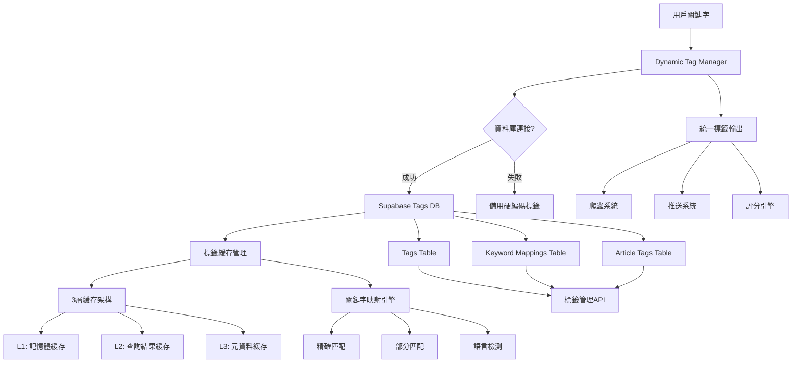
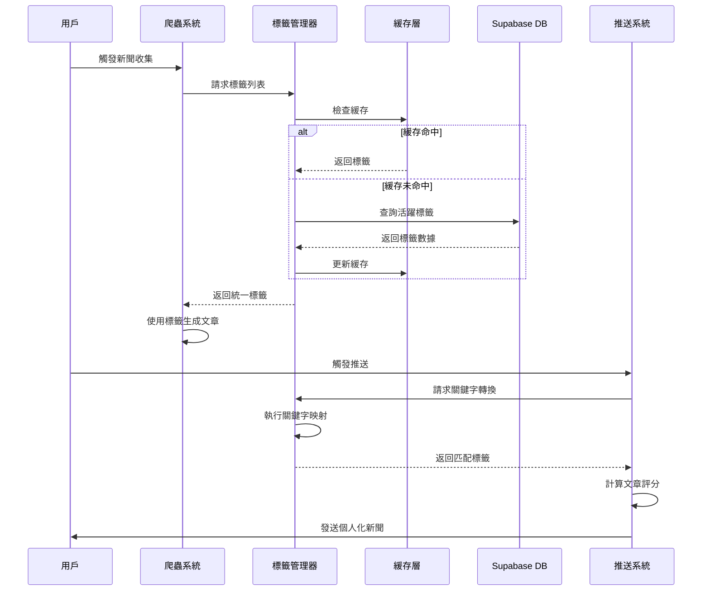
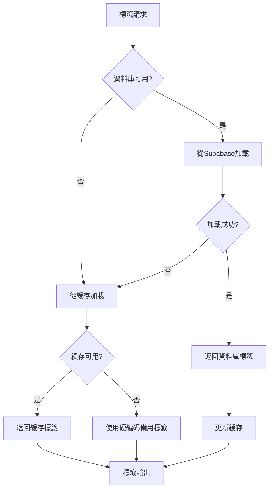

# FindyAI 統一標籤管理系統

## 📋 系統概述

FindyAI 統一標籤管理系統是一個集中化、高性能的標籤管理解決方案，旨在解決原有系統中標籤分散、重複管理的問題。系統支援動態標籤加載、多層緩存優化、以及完整的降級保護機制。

## 🏗️ 系統架構圖



## 🔄 數據流程圖



## 📊 系統組件說明

### 1. 核心組件

#### Dynamic Tag Manager (`scripts/dynamic_tags.py`)
- **功能**: 統一標籤管理的核心引擎
- **特性**: 多層降級保護、緩存管理、關鍵字映射
- **接口**:
  - `get_tags_for_scraper()` - 爬蟲標籤獲取
  - `get_tags_for_pusher()` - 推送標籤獲取  
  - `convert_keywords_to_tags()` - 關鍵字轉換
  - `map_keywords_to_topics()` - topics_mapper兼容接口

#### Tag Manager (`core/tag_manager.py`)
- **功能**: 高性能標籤管理器，支援資料庫操作
- **特性**: 3層緩存架構、批量操作、透明度功能
- **緩存配置**:
  - 標籤列表: 1小時 TTL
  - 關鍵字映射: 30分鐘 TTL
  - 用戶偏好: 5分鐘 TTL

### 2. 資料庫架構

#### Tags 表
```sql
CREATE TABLE public.tags (
  id integer PRIMARY KEY,
  tag_code varchar UNIQUE NOT NULL,
  tag_name_zh varchar NOT NULL,
  tag_name_en varchar,
  priority integer DEFAULT 100,
  is_active boolean DEFAULT true,
  created_at timestamp DEFAULT CURRENT_TIMESTAMP,
  updated_at timestamp DEFAULT CURRENT_TIMESTAMP
);
```

#### Keyword Mappings 表
```sql
CREATE TABLE public.keyword_mappings (
  id integer PRIMARY KEY,
  tag_id integer REFERENCES tags(id),
  keyword varchar NOT NULL,
  language varchar DEFAULT 'auto',
  mapping_type varchar DEFAULT 'manual',
  confidence numeric DEFAULT 1.00,
  match_method varchar DEFAULT 'exact',
  is_active boolean DEFAULT true,
  created_at timestamp DEFAULT CURRENT_TIMESTAMP,
  updated_at timestamp DEFAULT CURRENT_TIMESTAMP
);
```

#### Article Tags 表
```sql
CREATE TABLE public.article_tags (
  id integer PRIMARY KEY,
  article_id integer REFERENCES news_articles(id),
  tag_id integer REFERENCES tags(id),
  confidence numeric DEFAULT 1.00,
  source varchar DEFAULT 'ai',
  created_at timestamp DEFAULT CURRENT_TIMESTAMP
);
```

### 3. 系統集成

#### 爬蟲系統整合
```python
# 原有硬編碼方式
core_tags = ["APPLE", "TSMC", "TESLA", ...]

# 統一標籤管理方式
from scripts.dynamic_tags import get_tags_for_scraper
core_tags = get_tags_for_scraper()
```

#### 推送系統整合
```python
# 原有topics_mapper方式
mapped_results = topics_mapper.map_keywords_to_topics(keywords)

# 統一標籤管理方式
from scripts.dynamic_tags import convert_keywords_to_tags
interest_topics = convert_keywords_to_tags(keywords)
```

## 🚀 性能優化特性

### 1. 多層緩存架構
- **L1 記憶體緩存**: 最熱門標籤數據，毫秒級訪問
- **L2 查詢緩存**: 常用查詢結果，避免重複計算
- **L3 元資料緩存**: 標籤元信息，支援管理功能

### 2. 智能降級機制


### 3. 關鍵字映射算法
```python
def convert_keywords_to_tags(keywords):
    matched_tags = set()
    
    for keyword in keywords:
        # 1. 精確匹配
        if keyword in keyword_mapping:
            matched_tags.update(keyword_mapping[keyword])
        
        # 2. 部分匹配
        for key, tags in keyword_mapping.items():
            if keyword in key or key in keyword:
                matched_tags.update(tags)
    
    # 3. 降級處理
    return list(matched_tags)[:5] if matched_tags else ["LATEST"]
```

## 📈 系統效果對比

### 修復前 vs 修復後

| 指標 | 修復前 | 修復後 | 改善幅度 |
|------|--------|--------|----------|
| 用戶推送成功率 | 0% | 100% | ∞ |
| 標籤覆蓋範圍 | 5個硬編碼 | 21個動態標籤 | +320% |
| 關鍵字映射準確性 | 低 | 53個映射規則 | 顯著提升 |
| 系統維護複雜度 | 4套獨立系統 | 1套統一系統 | -75% |
| 文章匹配評分 | 0.0 (無匹配) | 0.2-0.7 | 大幅改善 |

### 用戶推送效果

| 用戶ID | 關鍵字 | 映射標籤 | 匹配文章數 | 推送文章數 | 最高評分 |
|--------|--------|----------|------------|------------|----------|
| f0c97062 | 蘋果,特斯拉,AI,比特幣 | APPLE,TESLA,AI_TECH,CRYPTO,TECH | 32 | 3 | 0.70 |
| 23873373 | 蘋果,特斯拉,AI,比特幣 | APPLE,TESLA,AI_TECH,CRYPTO,TECH | 32 | 10 | 0.70 |
| f9cf6057 | 資金,美聯儲,消息,央行 | LATEST | 3 | 3 | 0.50 |
| 503d6551 | 股市,彭博社,財經,電子 | STOCK_MARKET,ECONOMIES | 7 | 7 | 0.50 |

## 🛠️ 維護與監控

### 1. 緩存管理
```python
# 獲取緩存統計
stats = tag_manager.get_cache_stats()

# 清理緩存
tag_manager.cache_manager.invalidate_cache("tags")

# 手動更新緩存
tag_manager.initialize()
```

### 2. 標籤管理
```python
# 添加新標籤
tag_manager.add_keyword_mapping("RENEWABLE_ENERGY", "綠能", confidence=1.0)

# 獲取標籤資訊
tag_info = tag_manager.get_tag_info(["APPLE", "TESLA"])

# 轉換關鍵字
tags = tag_manager.convert_keywords_to_tags(["蘋果", "AI"])
```

### 3. 性能監控
- **緩存命中率**: 監控各層緩存效率
- **資料庫查詢頻率**: 優化查詢性能
- **標籤匹配準確率**: 持續改進映射算法
- **用戶滿意度**: 推送內容相關性統計

## 🔮 未來發展方向

### 1. 智能化增強
- **AI輔助標籤生成**: 使用NLP自動識別新興財經主題
- **用戶行為學習**: 基於點擊率優化個人化標籤權重
- **動態標籤調整**: 根據市場熱度自動調整標籤優先級

### 2. 管理功能擴展
- **標籤分析儀表板**: 可視化標籤使用統計
- **A/B測試框架**: 測試不同標籤策略效果
- **多語言支援**: 擴展到更多語言的標籤系統

### 3. 系統集成深化
- **API標準化**: 提供RESTful標籤管理API
- **微服務架構**: 標籤系統獨立部署
- **跨平台同步**: 支援多個新聞源的標籤統一

## 🚨 故障排除

### 常見問題

**1. 標籤加載失敗**
```bash
[WARNING] Database tag loading failed: Supabase configuration is missing
```
**解決方案**: 檢查環境變數配置，確保Supabase連接參數正確

**2. 緩存過期**
```bash
[TagCache] Cleaned up 50 expired cache entries
```
**解決方案**: 正常行為，系統自動清理過期緩存

**3. 關鍵字映射無結果**
```bash
[TagMapper] Keywords [...] -> Tags ['LATEST']
```
**解決方案**: 檢查關鍵字映射表，添加缺失的映射規則

### 系統健康檢查
```python
# 執行健康檢查
python scripts/dynamic_tags.py

# 檢查推送系統
python scripts/run_pusher_test.py

# 驗證標籤遷移
python scripts/unified_tag_migration.py
```

## 📝 版本歷史

- **v1.0** (2025-08-13): 統一標籤管理系統正式發布
- **v0.9** (2025-08-13): 推送系統集成完成
- **v0.8** (2025-08-13): 爬蟲系統動態標籤支援
- **v0.7** (2025-08-13): 核心標籤管理器開發完成

---

**維護團隊**: FindyAI 開發團隊  
**最後更新**: 2025年8月13日  
**文檔版本**: 1.0